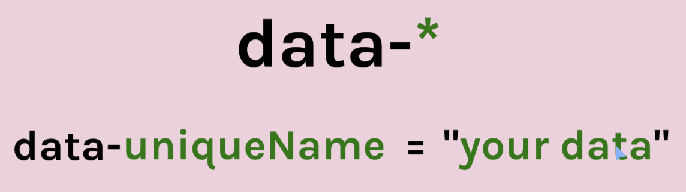
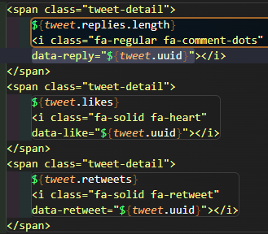
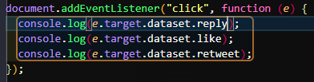

# Twimba - A Scimba-themed Twitter Clone

<div align="center"></div>

This is the 3rd project in the **[Scrimba](https://scrimba.com/) Frontend Developer Career Path**'s **Module 5** on **Essential JavaScript**.

I completed a previous iteration of Module 5 and heard that it was completely re-done. _Scrimba's always updating their awesome courses._ I had (re)learned some concepts and newly learned about `FormData` in the _fun-evil_ **[Cookie Consent project](https://github.com/JoleneKearse/cookie-consent)** and found the topics covered here to be exciting. I was really excited to discover how the **reply**, **like** & **retweet** buttons would be implemented. I worked on the **[Oldagram Instagram clone](https://github.com/JoleneKearse/oldagram)**, but moved on to other things (_a freelance project, and work with a team of fellow development learners_) before I got my like button working.

## Things this Project Taught

- the `.forEach()` method
- `CDN`s, or **Content Delivery Networks**, to **add icons** and **generate UUIDs**
- `textarea`
- **data attributes** to store info in an HTML element
- conditionally render styles
- logical not operator, `!`

So let's go see what cool new things I learned!

<hr>

## Brand-new Knowledge

### Breaking JS into Modules

_I was thrilled to see this, as it was originally why I had returned to Module 5! I love React's components, if for nothing else besides being able to view areas of JS code in different files, but hadn't successfully done it in JavaScript._

Here are the steps:

1. Add `type="module"` to your script tag in the HTML.
<div align="center"></div>

2. Create a new `.js` file with a descriptive file name.
3. Use the `export` keyword before file **variable** or **function** declarations.
<div align="center"></div>

4. Import the file to `index.js` using the variable or function names and tell it the root file.
<div align="center"></div>

**Note**: Modular code needs to be run on a server. But as long as you are using the **Live Server** VS Code extention you will be fine!

### `textarea` formatting

<div align="center"></div>

I would usually place the **closing tag** on another line, but that **breaks it**! So other than being a form of **input** not in an `<input>` tag, this is another weird thing to be aware of.

I also picked up this neat trick to **disable the resizing handlebars**:

```
textarea {
  resize: none;
}
```

### A More Complete Understanding of CDN's

- Remote service
- Provides assets: functions, styles, icons
- Gives a snippet of code to bring it into our projects

A great place to find all you need is **[cdnjs](https://cdnjs.com/)**.

### Avoiding an EventListener on each and every icon

To add an EventListener to each tweet's **comment**, **like**, and **retweet** would quickly become non-performant. _Imagine thousands of tweets each with 3 event listeners!_

**The Answer?**

A page-wide event listener is possible with **data attributes**. They will let you know which tweet they are associated with and which icon was clicked.

**Data attributes** store extra info in HTML elements. You can customize what type of info you want to keep in it, then set the value equal to a string.

<div align="center"></div>

We can add one in each icon to say that it is associated with which tweet via it's `uuid` - _more on that below._

<div align="center"></div>

Now we can click on each icon and get that tweet's uuid.

<div align="center"></div>

Next we create a function to handle each icon.

### uuid

A `uuid` is a **universally unique identifier**. It's common for **data sets** to have such a **key** to _ahem_ identify the **data blocks**. Each of the tweets will have one.

<hr>

## Tricky Parts to Navigate

### Font Awesome Icons Messing With Your Design

I've had this problem before: _I found the right icons, but their color didn't look good in my design._ What do you do in a situation like this?

<div align="center"></div>

Since the _offending_ icons both have a class of `fa-solid`, you can simply target that in the CSS and change it!

```
.fa-solid {
  color: #999999;
}
```
