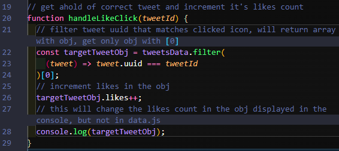

# Twimba - A Scimba-themed Twitter Clone

<p>
   
   
   
   
</p>

Visit the **[Live Site](https://twitter-clone-phi-pearl.vercel.app/)**!

<div align="center"></div>

This is the 3rd project in the **[Scrimba](https://scrimba.com/) Frontend Developer Career Path**'s **Module 5** on **Essential JavaScript**.

## Table of Contents

- [Things This Project Taught](https://github.com/JoleneKearse/twitter-clone#things-this-project-taught)
- [Brand-New Knowledge](https://github.com/JoleneKearse/twitter-clone#brand-new-knowledge)
  - [Breaking JS into Modules](https://github.com/JoleneKearse/twitter-clone#breaking-js-into-modules)
  - [`textarea` Formatting](https://github.com/JoleneKearse/twitter-clone#textarea-formatting)
  - [A More Complete Understanding of CDN's](https://github.com/JoleneKearse/twitter-clone#a-more-complete-understanding-of-cdns)
  - [Avoiding an EventListener on Each and Every Icon](https://github.com/JoleneKearse/twitter-clone#avoiding-an-eventlistener-on-each-and-every-icon)
  - [`uuid`](https://github.com/JoleneKearse/twitter-clone#uuid)
- [Tricky Parts to Navigate](https://github.com/JoleneKearse/twitter-clone#tricky-parts-to-navigate)
  - [Font Awesome Icons Messing With Your Design](https://github.com/JoleneKearse/twitter-clone#font-awesome-icons-messing-with-your-design)
  - [Keeping the Textarea Responsive](https://github.com/JoleneKearse/twitter-clone#keeping-the-textarea-responsive)
- [My Extras](https://github.com/JoleneKearse/twitter-clone#my-extras)
  - [Added Retweet to Feed](https://github.com/JoleneKearse/twitter-clone#added-retweet-to-feed)
  - [Light/Dark Mode Toggle](https://github.com/JoleneKearse/twitter-clone#lightdark-mode-toggle)

## Things this Project Taught

- the `.forEach()` method
- `CDN`s, or **Content Delivery Networks**, to **add icons** and **generate UUIDs**
- `textarea`
- **data attributes** to store info in an HTML element
- conditionally render styles
- logical not operator, `!`

So let's go see what cool new things I learned!

<hr>

## Brand-New Knowledge

### Breaking JS into Modules

_I was thrilled to see this, as it was originally why I had returned to Module 5! I love React's components, if for nothing else besides being able to view areas of JS code in different files, but hadn't successfully done it in JavaScript._

And here are the steps:

1. Add `type="module"` to your script tag in the HTML.
<div align="center"></div>

2. Create a new `.js` file with a descriptive file name.
3. Use the `export` keyword before file **variable** or **function** declarations.
<div align="center"></div>

4. Import the file to `index.js` using the variable or function names and tell it the root file path.
<div align="center"></div>

**Note**: Modular code needs to be run on a server. But as long as you are using the **Live Server** VS Code extention you will be fine!

### `textarea` Formatting

<div align="center"></div>

I would usually place the **closing tag** on another line, but that **breaks it**! So other than being a form of **input** not in an `<input>` tag, this is another weird thing to be aware of.

I also picked up this neat trick to **disable the resizing handlebars**:

```
textarea {
  resize: none;
}
```

### A More Complete Understanding of CDN's

- Remote service
- Provides assets: functions, styles, icons
- Gives a snippet of code to bring it into our projects

A great place to find all you need is **[cdnjs](https://cdnjs.com/)**.

### Avoiding an EventListener on Each and Every Icon

To add an EventListener to each tweet's **comment**, **like**, and **retweet** would quickly become non-performant. _Imagine thousands of tweets each with 3 event listeners!_

**The Answer?**

A page-wide event listener is possible with **data attributes**. They will let you know which tweet they are associated with and which icon was clicked.

**Data attributes** store extra info in HTML elements. You can customize what type of info you want to keep in it, then set the value equal to a string.

<div align="center"></div>

We can add one in each icon to say that it is associated with which tweet via it's `uuid` - _more on that below._

<div align="center"></div>

Now we can click on each icon and get that tweet's uuid.

<div align="center"></div>

Next we create a function to handle each icon. This will be the code for `handleLikeClick`.

1. Using an **`if` statement** within the document event listener ensures that only icon clicks cause a reaction.

<div align="center"></div>

2. Set up the function with filter for `tweet.uuid` matching the passed in`tweetId`. As the `.filter()` method returns an **array**, return the **object** itself with **bracket notation**, like on _line 24_.

<div align="center"></div>

3. Now that the tweet object is saved as the variable `targetTweetObj` use **dot notation** to access the `likes` property and **increment it**.

4. As the comment on _line 27_ says this will only change the count to your console, but not effect the original data file. **So copying objects and arrays have some strange behaviour.**

> This creates a **shallow** copy.
> 
> Creating a variable makes space in the program's memory, but a shallow copy doesn't take up more space. It is only a **reference to that original variable stored in memory**.
> Now if you change anything in `userObj` it will also change in `usersArray` as they are **the same thing**. Except for **primitive data types**, which do change!

5. Re-call `render()` and the new count will update on the page.

6. But we only want the ability to increment it and decrement it, not like lots of times as the function currently allows. So we add an **if/else** statement before `render` and also flip the **boolean** `isLiked`.

<div align="center"></div>

### `uuid`

A `uuid` is a **universally unique identifier**. It's common for **data sets** to have such a **key** to, _ahem_, identify the **data blocks**. Each of the tweets will have one.

**UUID**s are a complicated string of 36 alphanumeric characters used to identify a piece of data and are generally **globally unique**. Another name for them is **GUID**, but both are unique not just in your app, but globally/universally.

<div align="center"></div>

You can generate your own **Version 4 UUID** via [CDN builds](https://github.com/uuidjs/uuid#cdn-builds). Simply copy the **import statement** and the **function** below it.

<div align="center"></div>

<hr>

## Tricky Parts to Navigate

### Font Awesome Icons Messing With Your Design

I've had this problem before: _I found the right icons, but their color didn't look good in my design._ What do you do in a situation like this?

<div align="center"></div>

Since the _offending_ icons both have a class of `fa-solid`, you can simply target that in the CSS and change it!

```css
.fa-solid {
  color: #999999;
}
```

### Keeping the `textarea` Responsive

For the most part the new Tweet input was fine, but I noticed a scrollbar would appear at some screen sizes. I found `min-height: 100%` solved the issue!

## My Extras

### Added Retweet to Feed

I originally completed this with a one-liner...

<div align="center"></div>

... But it introduced a bug, where the retweet would remain in the feed! Thinking one step further, I arrived at this solution on _lines 56 & 59_.

<div align="center"></div>

### Light / Dark Mode Toggle

<div align="center"></div>

The **icon** was my first big hiccup! I already used **Font Awesome**, so I thought it would be simple. Nuh-uh, because I had to go and be all picky about it.

I was going to use a moon and sun icon, but wanted to simplify it to just one icon. I found an awesome one, but it wasn't showing up on the page. I was worried that it was _lost_ somewhere on the page. Finally I was able to force it to take up space, but it still wasn't showing. After reading through the docs, I hit upon the problem - I didn't choose a free one! 🤣 Fortunately the functionality was much more straight-forward...

I set up **CSS custom properties by inverting my neutral colours** and used another **data attribute**.

<div align="center"></div>

I added `id`s to the HTML to grab via JavaScript. One on the icon for the event listener, and the other on the body to make the change.

<div align="center"></div>

I set up the initial theme in `index.js`.

<div align="center"></div>

I added the icon `id` to the **event listener**.

<div align="center"></div>

Finally, I used a **if/else statement** to change the theme back and forth.

<div align="center"></div>
